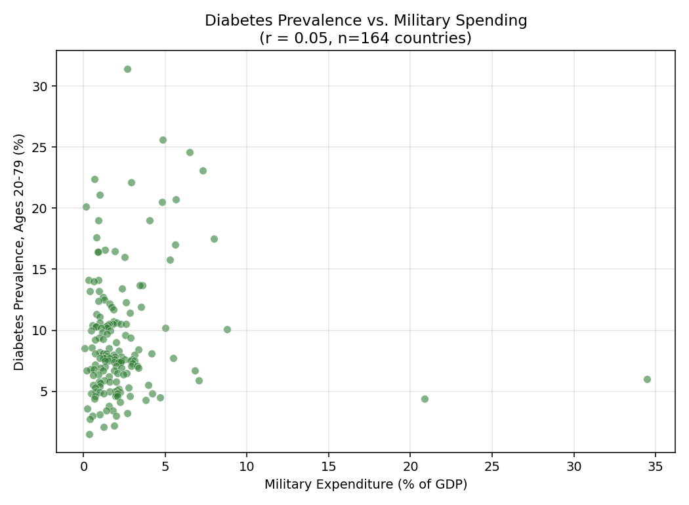
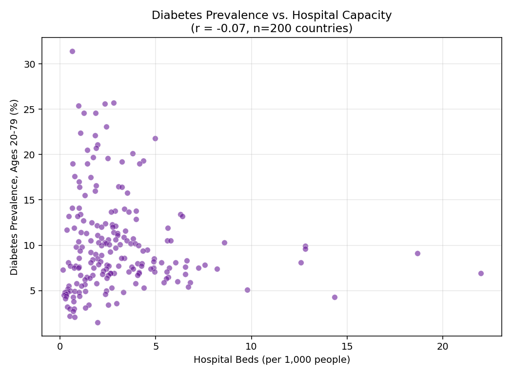
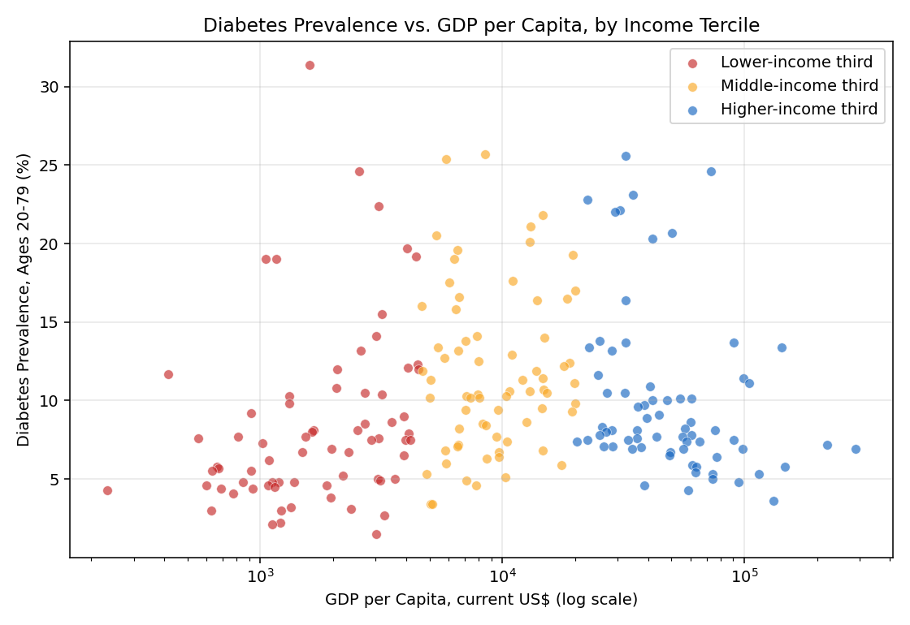
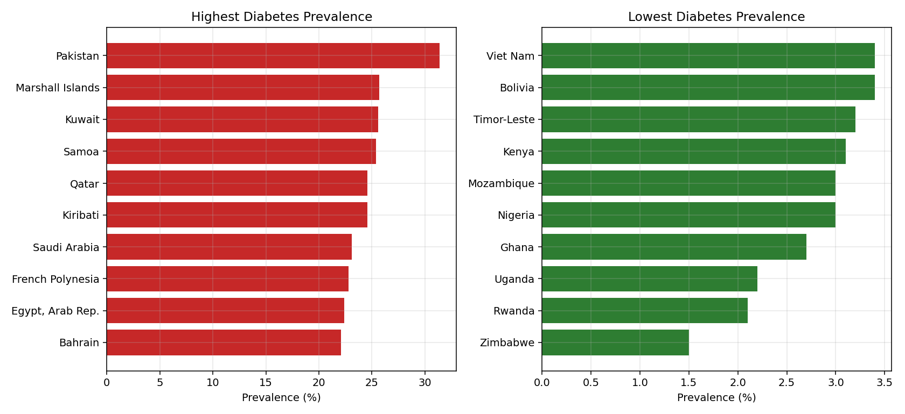

# Diabetes Burden, Spending Priorities & Health System Capacity

A cross-country data analysis exploring how government spending priorities
and health system capacity relate to non-communicable disease burden,
using diabetes prevalence as the lens. Built with real World Bank World
Development Indicators data.

## Why this project

I've spent time researching diabetes treatment approaches (comparative
work on traditional Korean medicine vs. Western pharmaceutical frameworks)
and I grew up around military health systems, which shaped an interest in
how public spending choices affect health outcomes and access. This
project combines those interests into one question: across countries, is
there a visible relationship between how governments allocate resources
(military spending, hospital capacity) and the burden of a major chronic
disease?

It's an exploratory, correlational analysis, not a causal study — the
point is asking a sharp, well-scoped policy question of real public data
and being honest about what the data can and can't show.

## Data

All data comes from the World Bank's World Development Indicators
(CC BY-4.0), via the [`datasets/world-development-indicators`](https://github.com/datasets/world-development-indicators)
GitHub mirror:

| Indicator | WDI code |
|---|---|
| Diabetes prevalence, % ages 20-79 | `SH.STA.DIAB.ZS` |
| Military expenditure, % of GDP | `MS.MIL.XPND.GD.ZS` |
| Hospital beds per 1,000 people | `SH.MED.BEDS.ZS` |
| GDP per capita, current US$ | `NY.GDP.PCAP.CD` |
| Life expectancy at birth, years | `SP.DYN.LE00.IN` |
| Deaths from non-communicable disease, % | `SH.DTH.NCOM.ZS` |

Raw CSVs are included in `data/`.

## Pipeline

1. **`load_and_merge.py`** — loads the six indicator files, strips World
   Bank regional/income-group aggregate rows to keep individual countries
   only, and merges them into `merged_panel.csv` (209 countries), using
   each country's most recently reported value per indicator.
2. **`analyze.py`** (script) / **`analyze.ipynb`** (interactive notebook) —
   run the same analysis; use `analyze.py` if you just want to regenerate
   the outputs, or open `analyze.ipynb` to walk through the analysis
   step by step. Both compute correlations and produce:
   - Diabetes prevalence vs. military expenditure (% GDP)
   - Diabetes prevalence vs. hospital bed capacity
   - Diabetes prevalence vs. GDP per capita, by income tercile
   - Highest/lowest diabetes-burden countries in the dataset
   - `findings.md`, a written summary of results and caveats

## Key findings (this run)

**Military spending is not a meaningful predictor of diabetes burden.**
Across 209 countries, the correlation between military expenditure (% of
GDP) and diabetes prevalence was essentially flat (r ≈ 0.05).



**Hospital bed capacity showed a similarly weak relationship** (r ≈ -0.07)
— more hospital beds per capita did not track with lower diabetes
prevalence in this cross-section.



**Diabetes prevalence does not fall cleanly with national income.**
Several higher-income countries — notably Gulf states and Pacific Island
nations — rank among the highest-prevalence in the dataset, consistent
with diabetes being a disease of both wealthy and rapidly urbanizing
middle-income settings, not only low-income ones.



**The highest- and lowest-burden countries in the dataset:**



Full write-up with caveats in [`findings.md`](findings.md).

## Tech

Python, pandas, matplotlib. Real World Bank data, no synthetic values.

## Run it yourself

```bash
pip install pandas matplotlib
python load_and_merge.py
python analyze.py
```

## Honest limitations

- Uses each indicator's most recent available year per country rather
  than one shared year (WDI reporting years vary widely by country and
  indicator) — this is a cross-sectional snapshot, not a time trend.
- Correlation, not causation — urbanization, diet, genetics, age
  structure, and diagnostic capacity are all plausible confounders.
- Diagnostic and surveillance capacity itself varies by country and
  correlates with health spending, which complicates any comparison of
  measured prevalence across health systems of differing strength.
